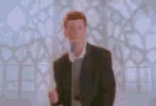

<h1 align="center">Unrickroll</h1>
<i align="center">Never gonna give you up...</i>

## What's this thing?

It's a simple web extension, that prevents you from accidentally getting Rick-rolled. Simply speaking - when you're about to open a page with Rick Astley's "Never gonna give you up", you'll be first shown a [warning](https://www.youtube.com/watch?v=dQw4w9WgXcQ) about what's going to happen.

## How's it made?

The extension is made mainly using those technologies:

- Webpack - for creating the required extension JS scripts
- TypeScript - who uses JavaScript in 2021?
- WebExtension API along with its [polyfill](https://github.com/mozilla/webextension-polyfill)

## Contributing

Take a look at the [issues](https://github.com/AdamSiekierski/unrickroll/issues) tab, and declare taking a task.

On the technical side - make a fork of the repo, create proposed changes, and open a PR to the main repo. Then wait for the review, and... that's basically it!

### How to develop?

1. Clone the repo
2. Install and use the recommended Node.js version - in the [.nvmrc](./nvmrc) file. Also - install `yarn`
3. Install all the required packages - `yarn install`
4. Run the development browser - `yarn dev`
5. And... that's basically it!
